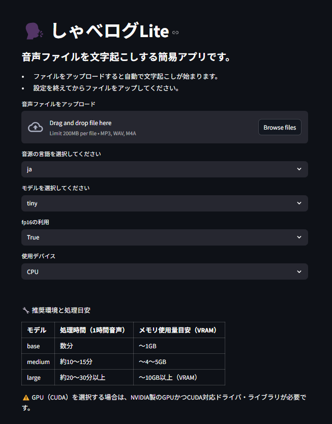
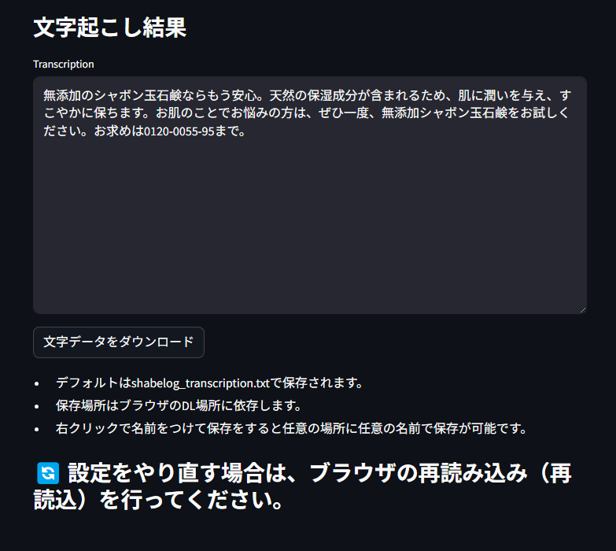

# 🗣️ しゃべログLite

音声ファイルを Whipser で文字起こしする、超軽量・超直感的なストリーム処理アプリです。  
Streamlit ベースで構築されており、GPU (CUDA) 環境にも対応しています。

---

## 🚀 特徴

- 📂 音声ファイル（mp3/wav/m4a）をアップロードして即文字起こし
- ⚙️ Whisper モデル選択（tiny〜large）
- 💬 言語指定（日本語 / 英語 など多言語対応）
- 🧠 fp16 / CUDA 利用設定可
- 📉 進捗プログレスバー付きで処理の見える化
- 📜 文字起こし結果を表示・保存
- 🧼 結果表示後はUIを最小限にスリム化
- ✅ 再実行時は「再読み込み」を明示して誤再処理を回避

---

## 🛠️ 必要環境

- Python 3.8+
- CUDA 11.8+ (GPU利用時)
- 以下の主要ライブラリ

```bash
pip install -r requirements.txt
# または
pip install streamlit torch torchvision torchaudio numpy openai-whisper
```

---

## ▶️ 起動方法

```bash
streamlit run shabelog_lite_final.py
```

ブラウザが開いたら、音声ファイルをアップロードして設定すれば即スタートできます。

---

## 🖼️ 使用イメージ

### 🔽 設定画面



### ✅ 文字起こし結果表示



---

## 🔁 再実行時の注意

> 🔄 設定をやり直す場合は、ブラウザの再読み込み（再読込）を行ってください。

セッション状態による誤動作や再解析防止のため、設定のやり直しには「ブラウザの再読み込み」を行ってください。

---
## 💻 Google Colab 版（お試し・GPU推奨）
> Google Colab で実行できるしゃべログLiteです。
GPUモードで large モデルまで快適に動作します。

✅ インストール不要・即実行可

✅ GPUを使った高速文字起こし対応

✅ ngrokトンネル経由でWebUI操作OK

📎 ノートブックはこちら（Googleアカウント要）
👉 [shabelog_lite_colab_ngrok.ipynb](https://drive.google.com/file/d/17-3P6XHtpfSA3jSXWFyCycra1Fx0lLC4/view?usp=sharing)


## 🤖 開発・作者

- 開発：[ElfwCM]
- ベースモデル：OpenAI Whisper

---

## 💡 備考

- medium モデル以上は初回DLに時間がかかります（2〜3GB）
- 録音機能付きのpro版も開発予定です！
"# ShabeLog_Lite" 
